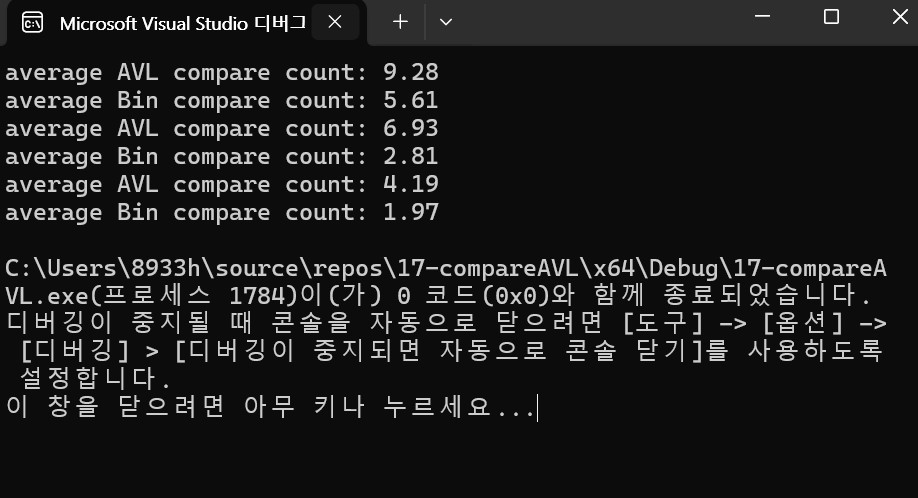

# 이진 탐색 트리와 AVL에 대한 탐색의 비교횟수를 비교분석
이진 탐색 트리(BST) 는 트리가 균형잡힌 상태이면, 트리의 높이가 O(log n) 이게 되므로 탐색횟수도 똑같이 나오게 됩니다.
하지만 최악의 경우는 불균형 상태일 때, 그저 선형 탐색과 동일한 성능으로 보이며 O(n)이 됩니다. 
구현이 간단하며 삽입 과 삭제시에는 불균형이 쉽게 발생할 수 있어서 트리의 높이가 커지면 탐색성능이 크게 떨어지게됩니다.

AVL트리는 자기 균형 이진 탐색 트리입니다. 이는 왼쪽 서브트리와 오른쪽 서브트리의 높이차는 최대 1로 제한되어 있습니다.
노드 삽입, 삭제 시에는 회전이 발생합니다. 이 트리는 항상 균형잡힌 상태가 특징이며 최악의 경우에도 O(log n) 입니다.

결론으로는 탐색 성능이 중요하고 데이터가 동적으로 변할 때에는 AVL트리가 적합합니다. 하지만 삽입과 삭제의 횟수가 낮고
트리 균형을 확실하게 유지할 수 있을 때에는 이진 탐색 트리가 적합하게 됩니다.

# Result image

